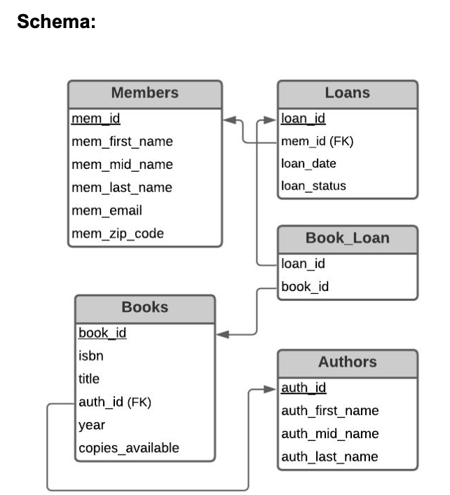
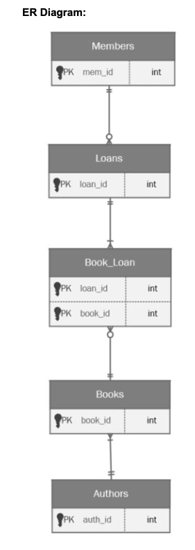
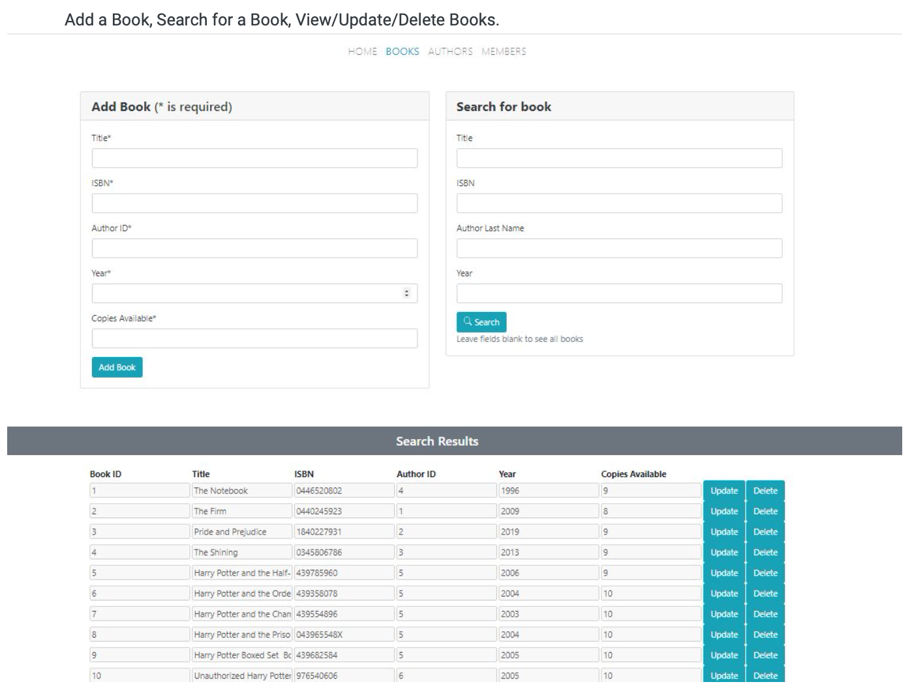
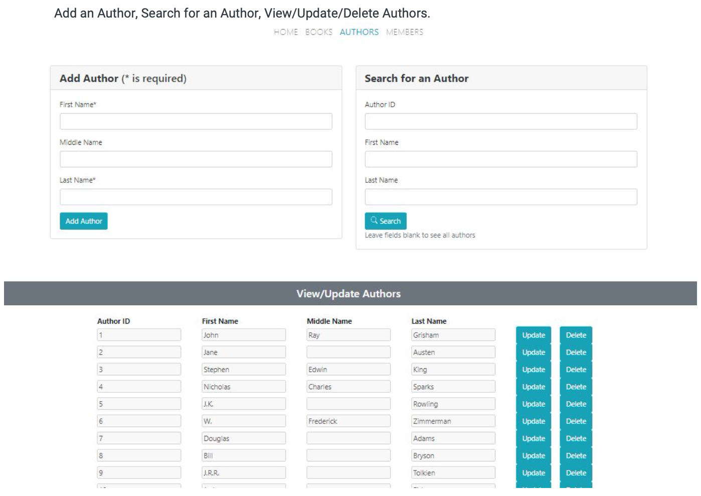
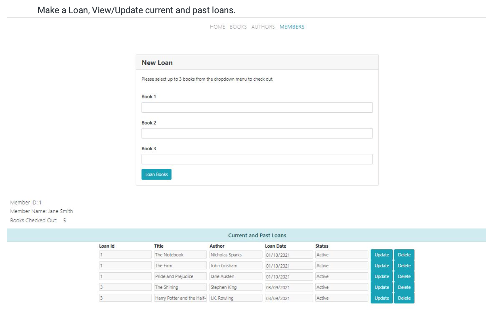

# Online Library Web App

This project aimed to simulate certain functionalities and management of an Online Library by implementing CRUD operations and data storage via MariaDB. 
The library supports the management of existing and new members, books and authors via CRUD operations and the operation of loans of books to members.
Any CRUD operation is dynamically reflected in the website. E.g. After adding a new book, the new book and its details will be instantly shown in the results section.

## Details:
  - A member can sign up and borrow up to 5 books at any time. It is not possible to rent more than 1 copy of the same book.
  - If the member has rented 5 books and wishes to rent a different book, the member will need to return one or more books.
  - Each book title has a limit of 10 digital copies.
  - Returning or deleting a book will automatically update the total number/amount of that respective book.
  - Each book only has one author. 
  - Books in the library can have the same author.
  - CRUD operations are enabled for member, book and authors. 
  
## Schema & ER Diagram

## Pages

## Hosting
- The Library Web App was hosted on a school server using Node.js and Express.js. 
- The app was connected to MariaDB

